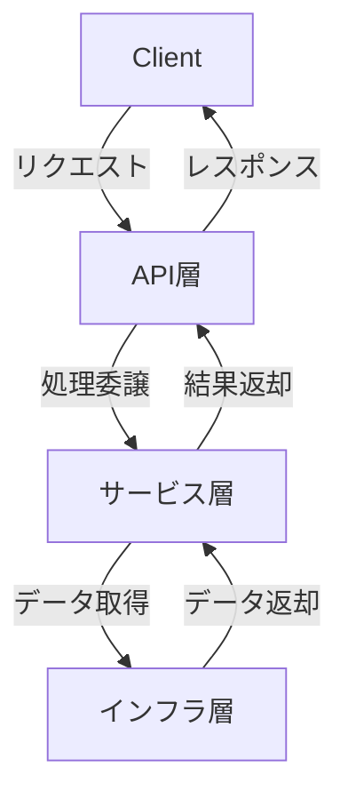

This file is a merged representation of the entire codebase, combined into a single document by Repomix.

# File Summary

## Purpose
This file contains a packed representation of the entire repository's contents.
It is designed to be easily consumable by AI systems for analysis, code review,
or other automated processes.

## File Format
The content is organized as follows:
1. This summary section
2. Repository information
3. Directory structure
4. Repository files (if enabled)
5. Multiple file entries, each consisting of:
  a. A header with the file path (## File: path/to/file)
  b. The full contents of the file in a code block

## Usage Guidelines
- This file should be treated as read-only. Any changes should be made to the
  original repository files, not this packed version.
- When processing this file, use the file path to distinguish
  between different files in the repository.
- Be aware that this file may contain sensitive information. Handle it with
  the same level of security as you would the original repository.

## Notes
- Some files may have been excluded based on .gitignore rules and Repomix's configuration
- Binary files are not included in this packed representation. Please refer to the Repository Structure section for a complete list of file paths, including binary files
- Files matching patterns in .gitignore are excluded
- Files matching default ignore patterns are excluded
- Files are sorted by Git change count (files with more changes are at the bottom)

# Directory Structure
```
.env.sample
.github/workflows/test.yml
.github/workflows/typespec.yml
.gitignore
appsettings.Development.json
AuthDemo.sln
docker-compose.yml
package.json
README.md
Spec/auth.tsp
Spec/main.tsp
src/AuthDemo.Api.Tests/AuthDemo.Api.Tests.csproj
src/AuthDemo.Api.Tests/Helpers/HttpClientExtensions.cs
src/AuthDemo.Api.Tests/Security/CustomWebApplicationFactory.cs
src/AuthDemo.Api.Tests/Security/JwtAuthenticationTests.cs
src/AuthDemo.Api.Tests/Security/JwtTokenHelper.cs
src/AuthDemo.Api/appsettings.json
src/AuthDemo.Api/AuthDemo.Api.csproj
src/AuthDemo.Api/Common/TestJwtConstants.cs
src/AuthDemo.Api/Extensions/ApplicationExtensions.cs
src/AuthDemo.Api/Extensions/JwtAuthenticationExtensions.cs
src/AuthDemo.Api/Extensions/ServiceCollectionExtensions.cs
src/AuthDemo.Api/Models/AuthModels.cs
src/AuthDemo.Api/Options/JwtOptions.cs
src/AuthDemo.Api/Program.cs
src/AuthDemo.Api/Security/PasswordHasher.cs
src/AuthDemo.Api/Services/IUserService.cs
src/AuthDemo.Api/Services/UserService.cs
src/AuthDemo.Infrastructure/AuthDemo.Infrastructure.csproj
src/AuthDemo.Infrastructure/Entities/User.cs
src/AuthDemo.Infrastructure/Migrations/20250706094333_InitialCreate.cs
src/AuthDemo.Infrastructure/Migrations/ApplicationDbContextModelSnapshot.cs
src/AuthDemo.Infrastructure/Persistence/ApplicationDbContext.cs
src/AuthDemo.Infrastructure/Persistence/DesignTimeDbContextFactory.cs
tspconfig.yaml
wiki/.git/COMMIT_EDITMSG
wiki/.git/config
wiki/.git/description
wiki/.git/FETCH_HEAD
wiki/.git/HEAD
wiki/.git/hooks/applypatch-msg.sample
wiki/.git/hooks/commit-msg.sample
wiki/.git/hooks/fsmonitor-watchman.sample
wiki/.git/hooks/post-update.sample
wiki/.git/hooks/pre-applypatch.sample
wiki/.git/hooks/pre-commit.sample
wiki/.git/hooks/pre-merge-commit.sample
wiki/.git/hooks/pre-push.sample
wiki/.git/hooks/pre-rebase.sample
wiki/.git/hooks/pre-receive.sample
wiki/.git/hooks/prepare-commit-msg.sample
wiki/.git/hooks/push-to-checkout.sample
wiki/.git/hooks/sendemail-validate.sample
wiki/.git/hooks/update.sample
wiki/.git/info/exclude
wiki/.git/logs/HEAD
wiki/.git/logs/refs/heads/master
wiki/.git/logs/refs/remotes/origin/HEAD
wiki/.git/logs/refs/remotes/origin/master
wiki/.git/ORIG_HEAD
wiki/.git/packed-refs
wiki/.git/refs/heads/master
wiki/.git/refs/remotes/origin/HEAD
wiki/.git/refs/remotes/origin/master
wiki/data-flow-diagram.md
wiki/Home.md
```

# Files

## File: .gitignore
````
#################################
# .NET / Visual Studio / VS Code
#################################
bin/
obj/
*.user
*.suo
.vs/
.vscode/

#################################
# Build 出力
#################################
*.pdb
*.dll
*.runtimeconfig.json

#################################
# NuGet design-time / restore キャッシュ
#################################
**/obj/**/*.nuget.*
**/obj/**/project.assets.json
**/obj/**/project.nuget.cache

#################################
# EF Core design-time
#   ─ Designer.cs は自動生成なので除外
#   ─ *Snapshot.cs は「コミットする派 / しない派」どちらか決めて
#################################
**/Migrations/*.Designer.cs
# **/Migrations/*Snapshot.cs   ← ★スナップショットをコミットしないなら有効化

#################################
# Node (if any)
#################################
node_modules/
npm-debug.log*

#################################
# Docker / WSL / 大容量ファイル
#################################
*.vhdx
AppData/Local/Docker/
DockerDesktop.vhdx

#################################
# Logs / 一時ファイル / バックアップ
#################################
*.log
*~                                   # 末尾チルダのバックアップ

#################################
# Dev-only launchSettings / local config
#################################
src/**/Properties/launchSettings.json
src/**/appsettings.Development.json
Generated/
src/**/Class1.cs
.env
````

## File: docker-compose.yml
````yaml
services:
  db:
    image: postgres:16-alpine
    env_file: .env
    environment:
      POSTGRES_USER: ${POSTGRES_USER}
      POSTGRES_PASSWORD: ${POSTGRES_PASSWORD}
      POSTGRES_DB: ${POSTGRES_DB}
    ports: ["5432:5432"]

    volumes:
      - dbdata:/var/lib/postgresql/data

volumes:
  dbdata:
````

## File: package.json
````json
{
  "name": "authdemo-typespec-jwt",
  "version": "1.0.0",
  "description": "",
  "main": "index.js",
  "scripts": {
    "test": "echo \"Error: no test specified\" && exit 1",
    "tsp:compile": "tsp compile Spec/auth.tsp"
  },
  "keywords": [],
  "author": "",
  "license": "ISC",
  "devDependencies": {
    "@typespec/compiler": "^1.1.0",
    "@typespec/http": "^1.1.0",
    "@typespec/http-server-csharp": "^0.58.0-alpha.17",
    "@typespec/openapi3": "^1.1.0"
  }
}
````

## File: src/AuthDemo.Api/appsettings.json
````json
{
  "Logging": {
    "LogLevel": {
      "Default": "Information",
      "Microsoft.AspNetCore": "Warning"
    }
  },
  "AllowedHosts": "*"
}
````

## File: src/AuthDemo.Api/Options/JwtOptions.cs
````csharp
namespace AuthDemo.Api.Options;

public class JwtOptions
{
    public const string SectionName = "Jwt";

    public string Issuer { get; set; } = string.Empty;
    public string Audience { get; set; } = string.Empty;
    public string Key { get; set; } = string.Empty;
}
````

## File: src/AuthDemo.Api/Security/PasswordHasher.cs
````csharp
using BCrypt.Net;

namespace AuthDemo.Api.Security;

public interface IPasswordHasher
{
    string HashPassword(string password);
    bool VerifyPassword(string password, string hash);
}

public class PasswordHasher : IPasswordHasher
{
    private const int WorkFactor = 12;  // BCryptのワークファクター（計算コスト）

    public string HashPassword(string password)
    {
        return BCrypt.Net.BCrypt.HashPassword(password, WorkFactor);
    }

    public bool VerifyPassword(string password, string hash)
    {
        try
        {
            return BCrypt.Net.BCrypt.Verify(password, hash);
        }
        catch (Exception)
        {
            // ハッシュが無効な場合などの例外は検証失敗として扱う
            return false;
        }
    }
}
````

## File: src/AuthDemo.Api/Services/IUserService.cs
````csharp
using AuthDemo.Infrastructure.Entities;

namespace AuthDemo.Api.Services;

public record SignUpResult(string Id, string Username);
public record SignInResult(string Token, string Username);

public interface IUserService
{
    /// <summary>
    /// ユーザーを新規登録します
    /// </summary>
    Task<SignUpResult> SignUpAsync(string username, string password);

    /// <summary>
    /// ユーザーを認証し、JWTトークンを発行します
    /// </summary>
    Task<SignInResult> SignInAsync(string username, string password);

    /// <summary>
    /// ユーザー名が既に使用されているかを確認します
    /// </summary>
    Task<bool> IsUsernameExistsAsync(string username);
}
````

## File: src/AuthDemo.Api/Services/UserService.cs
````csharp
using System.IdentityModel.Tokens.Jwt;
using System.Security.Claims;
using System.Text;
using AuthDemo.Api.Options;
using AuthDemo.Api.Security;
using AuthDemo.Infrastructure.Entities;
using AuthDemo.Infrastructure.Persistence;
using Microsoft.EntityFrameworkCore;
using Microsoft.Extensions.Options;
using Microsoft.IdentityModel.Tokens;

namespace AuthDemo.Api.Services;

public class UserService : IUserService
{
    private readonly ApplicationDbContext _dbContext;
    private readonly IPasswordHasher _passwordHasher;
    private readonly JwtOptions _jwtOptions;

    public UserService(
        ApplicationDbContext dbContext,
        IPasswordHasher passwordHasher,
        IOptions<JwtOptions> jwtOptions)
    {
        _dbContext = dbContext;
        _passwordHasher = passwordHasher;
        _jwtOptions = jwtOptions.Value;
    }

    public async Task<SignUpResult> SignUpAsync(string username, string password)
    {
        // ユーザー名の重複チェック
        if (await IsUsernameExistsAsync(username))
        {
            throw new InvalidOperationException("Username already exists");
        }

        // パスワードのハッシュ化とユーザー作成
        var user = new User
        {
            Email = username,
            PasswordHash = _passwordHasher.HashPassword(password)
        };

        _dbContext.Users.Add(user);
        await _dbContext.SaveChangesAsync();

        return new SignUpResult(user.Id.ToString(), user.Email);
    }

    public async Task<SignInResult> SignInAsync(string username, string password)
    {
        // ユーザーの検索
        var user = await _dbContext.Users
            .FirstOrDefaultAsync(u => u.Email == username && !u.IsDeleted);

        if (user == null)
        {
            throw new InvalidOperationException("Invalid username or password");
        }

        // パスワードの検証
        if (!_passwordHasher.VerifyPassword(password, user.PasswordHash))
        {
            throw new InvalidOperationException("Invalid username or password");
        }

        // JWTトークンの生成
        var token = GenerateJwtToken(user);

        return new SignInResult(token, user.Email);
    }

    public async Task<bool> IsUsernameExistsAsync(string username)
    {
        return await _dbContext.Users
            .AnyAsync(u => u.Email == username && !u.IsDeleted);
    }

    private string GenerateJwtToken(User user)
    {
        var key = new SymmetricSecurityKey(
            Encoding.UTF8.GetBytes(_jwtOptions.Key));
        var credentials = new SigningCredentials(
            key, SecurityAlgorithms.HmacSha256);

        var claims = new List<Claim>
        {
            new(JwtRegisteredClaimNames.Sub, user.Id.ToString()),
            new(JwtRegisteredClaimNames.Email, user.Email),
            new(JwtRegisteredClaimNames.Jti, Guid.NewGuid().ToString()),
        };

        var token = new JwtSecurityToken(
            issuer: _jwtOptions.Issuer,
            audience: _jwtOptions.Audience,
            claims: claims,
            expires: DateTime.UtcNow.AddHours(1),
            signingCredentials: credentials);

        return new JwtSecurityTokenHandler().WriteToken(token);
    }
}
````

## File: src/AuthDemo.Infrastructure/AuthDemo.Infrastructure.csproj
````
<Project Sdk="Microsoft.NET.Sdk">

  <PropertyGroup>
    <TargetFramework>net8.0</TargetFramework>
    <ImplicitUsings>enable</ImplicitUsings>
    <Nullable>enable</Nullable>
  </PropertyGroup>

  <ItemGroup>
    <PackageReference Include="Microsoft.EntityFrameworkCore" Version="8.0.11" />
    <PackageReference Include="Microsoft.EntityFrameworkCore.Design" Version="8.0.11">
      <IncludeAssets>runtime; build; native; contentfiles; analyzers; buildtransitive</IncludeAssets>
      <PrivateAssets>all</PrivateAssets>
    </PackageReference>
    <PackageReference Include="Npgsql.EntityFrameworkCore.PostgreSQL" Version="8.0.11" />
  </ItemGroup>

</Project>
````

## File: src/AuthDemo.Infrastructure/Migrations/20250706094333_InitialCreate.cs
````csharp
using System;
using Microsoft.EntityFrameworkCore.Migrations;

#nullable disable

namespace AuthDemo.Infrastructure.Migrations
{
    /// <inheritdoc />
    public partial class InitialCreate : Migration
    {
        /// <inheritdoc />
        protected override void Up(MigrationBuilder migrationBuilder)
        {
            migrationBuilder.CreateTable(
                name: "Users",
                columns: table => new
                {
                    Id = table.Column<Guid>(type: "uuid", nullable: false),
                    Email = table.Column<string>(type: "character varying(255)", maxLength: 255, nullable: false),
                    PasswordHash = table.Column<string>(type: "text", nullable: false),
                    CreatedAt = table.Column<DateTime>(type: "timestamp with time zone", nullable: false),
                    IsDeleted = table.Column<bool>(type: "boolean", nullable: false)
                },
                constraints: table =>
                {
                    table.PrimaryKey("PK_Users", x => x.Id);
                });

            migrationBuilder.CreateIndex(
                name: "IX_Users_Email",
                table: "Users",
                column: "Email",
                unique: true);
        }

        /// <inheritdoc />
        protected override void Down(MigrationBuilder migrationBuilder)
        {
            migrationBuilder.DropTable(
                name: "Users");
        }
    }
}
````

## File: src/AuthDemo.Infrastructure/Migrations/ApplicationDbContextModelSnapshot.cs
````csharp
// <auto-generated />
using System;
using AuthDemo.Infrastructure.Persistence;
using Microsoft.EntityFrameworkCore;
using Microsoft.EntityFrameworkCore.Infrastructure;
using Microsoft.EntityFrameworkCore.Storage.ValueConversion;
using Npgsql.EntityFrameworkCore.PostgreSQL.Metadata;

#nullable disable

namespace AuthDemo.Infrastructure.Migrations
{
    [DbContext(typeof(ApplicationDbContext))]
    partial class ApplicationDbContextModelSnapshot : ModelSnapshot
    {
        protected override void BuildModel(ModelBuilder modelBuilder)
        {
#pragma warning disable 612, 618
            modelBuilder
                .HasAnnotation("ProductVersion", "8.0.11")
                .HasAnnotation("Relational:MaxIdentifierLength", 63);

            NpgsqlModelBuilderExtensions.UseIdentityByDefaultColumns(modelBuilder);

            modelBuilder.Entity("AuthDemo.Infrastructure.Entities.User", b =>
                {
                    b.Property<Guid>("Id")
                        .ValueGeneratedOnAdd()
                        .HasColumnType("uuid");

                    b.Property<DateTime>("CreatedAt")
                        .HasColumnType("timestamp with time zone");

                    b.Property<string>("Email")
                        .IsRequired()
                        .HasMaxLength(255)
                        .HasColumnType("character varying(255)");

                    b.Property<bool>("IsDeleted")
                        .HasColumnType("boolean");

                    b.Property<string>("PasswordHash")
                        .IsRequired()
                        .HasColumnType("text");

                    b.HasKey("Id");

                    b.HasIndex("Email")
                        .IsUnique();

                    b.ToTable("Users");
                });
#pragma warning restore 612, 618
        }
    }
}
````

## File: src/AuthDemo.Infrastructure/Persistence/ApplicationDbContext.cs
````csharp
using AuthDemo.Infrastructure.Entities;
using Microsoft.EntityFrameworkCore;

namespace AuthDemo.Infrastructure.Persistence;

public class ApplicationDbContext(DbContextOptions<ApplicationDbContext> options)
    : DbContext(options)
{
    public DbSet<User> Users => Set<User>();

    protected override void OnModelCreating(ModelBuilder modelBuilder)
    {
        // User テーブル構成
        modelBuilder.Entity<User>(entity =>
        {
            entity.HasKey(u => u.Id);

            entity.Property(u => u.Email)
                  .IsRequired()
                  .HasMaxLength(255);

            entity.HasIndex(u => u.Email)
                  .IsUnique();

            // ソフトデリート用フィルター (Phase 2 で IsDeleted に切り替え)
            entity.HasQueryFilter(u => !u.IsDeleted);
        });
    }
}
````

## File: src/AuthDemo.Infrastructure/Persistence/DesignTimeDbContextFactory.cs
````csharp
using Microsoft.EntityFrameworkCore;
using Microsoft.EntityFrameworkCore.Design;

namespace AuthDemo.Infrastructure.Persistence;

public sealed class DesignTimeDbContextFactory
    : IDesignTimeDbContextFactory<ApplicationDbContext>
{
    public ApplicationDbContext CreateDbContext(string[] args)
    {
        // ① 接続文字列を直接書くか、環境変数 / user-secrets から読む
        var conn = Environment.GetEnvironmentVariable("POSTGRES_CONN")
                   ?? "Host=localhost;Port=5432;Database=authdemo;Username=postgres;Password=postgres";

        var opts = new DbContextOptionsBuilder<ApplicationDbContext>()
                   .UseNpgsql(conn, o => o.MigrationsAssembly(typeof(ApplicationDbContext).Assembly.FullName))
                   .EnableSensitiveDataLogging()     // ← 好みで
                   .Options;

        return new ApplicationDbContext(opts);
    }
}
````

## File: tspconfig.yaml
````yaml
emit:
  - "@typespec/openapi3"
  - "@typespec/http-server-csharp"

output-dir: "{project-root}/Generated"

options:
  "@typespec/openapi3":
    file-type: yaml
  "@typespec/http-server-csharp":
    project-name: AuthDemo
    # emitter-output-dir: "{output-dir}/server"  # 追加したい場合は有効なキーで
````

## File: wiki/.git/COMMIT_EDITMSG
````
JWT設定とエラーハンドリングの改善、セキュリティテストケースの追加
````

## File: wiki/.git/config
````
[core]
	repositoryformatversion = 0
	filemode = false
	bare = false
	logallrefupdates = true
	symlinks = false
	ignorecase = true
[remote "origin"]
	url = https://github.com/sode0417/authdemo-typespec-jwt.wiki.git
	fetch = +refs/heads/*:refs/remotes/origin/*
[branch "master"]
	remote = origin
	merge = refs/heads/master
	vscode-merge-base = origin/master
````

## File: wiki/.git/description
````
Unnamed repository; edit this file 'description' to name the repository.
````

## File: wiki/.git/FETCH_HEAD
````
d4eeb5aa95632a835a850eac294120ff35981e28		branch 'master' of https://github.com/sode0417/authdemo-typespec-jwt.wiki
````

## File: wiki/.git/HEAD
````
ref: refs/heads/master
````

## File: wiki/.git/hooks/applypatch-msg.sample
````
#!/bin/sh
#
# An example hook script to check the commit log message taken by
# applypatch from an e-mail message.
#
# The hook should exit with non-zero status after issuing an
# appropriate message if it wants to stop the commit.  The hook is
# allowed to edit the commit message file.
#
# To enable this hook, rename this file to "applypatch-msg".

. git-sh-setup
commitmsg="$(git rev-parse --git-path hooks/commit-msg)"
test -x "$commitmsg" && exec "$commitmsg" ${1+"$@"}
:
````

## File: wiki/.git/hooks/commit-msg.sample
````
#!/bin/sh
#
# An example hook script to check the commit log message.
# Called by "git commit" with one argument, the name of the file
# that has the commit message.  The hook should exit with non-zero
# status after issuing an appropriate message if it wants to stop the
# commit.  The hook is allowed to edit the commit message file.
#
# To enable this hook, rename this file to "commit-msg".

# Uncomment the below to add a Signed-off-by line to the message.
# Doing this in a hook is a bad idea in general, but the prepare-commit-msg
# hook is more suited to it.
#
# SOB=$(git var GIT_AUTHOR_IDENT | sed -n 's/^\(.*>\).*$/Signed-off-by: \1/p')
# grep -qs "^$SOB" "$1" || echo "$SOB" >> "$1"

# This example catches duplicate Signed-off-by lines.

test "" = "$(grep '^Signed-off-by: ' "$1" |
	 sort | uniq -c | sed -e '/^[ 	]*1[ 	]/d')" || {
	echo >&2 Duplicate Signed-off-by lines.
	exit 1
}
````

## File: wiki/.git/hooks/fsmonitor-watchman.sample
````
#!/usr/bin/perl

use strict;
use warnings;
use IPC::Open2;

# An example hook script to integrate Watchman
# (https://facebook.github.io/watchman/) with git to speed up detecting
# new and modified files.
#
# The hook is passed a version (currently 2) and last update token
# formatted as a string and outputs to stdout a new update token and
# all files that have been modified since the update token. Paths must
# be relative to the root of the working tree and separated by a single NUL.
#
# To enable this hook, rename this file to "query-watchman" and set
# 'git config core.fsmonitor .git/hooks/query-watchman'
#
my ($version, $last_update_token) = @ARGV;

# Uncomment for debugging
# print STDERR "$0 $version $last_update_token\n";

# Check the hook interface version
if ($version ne 2) {
	die "Unsupported query-fsmonitor hook version '$version'.\n" .
	    "Falling back to scanning...\n";
}

my $git_work_tree = get_working_dir();

my $retry = 1;

my $json_pkg;
eval {
	require JSON::XS;
	$json_pkg = "JSON::XS";
	1;
} or do {
	require JSON::PP;
	$json_pkg = "JSON::PP";
};

launch_watchman();

sub launch_watchman {
	my $o = watchman_query();
	if (is_work_tree_watched($o)) {
		output_result($o->{clock}, @{$o->{files}});
	}
}

sub output_result {
	my ($clockid, @files) = @_;

	# Uncomment for debugging watchman output
	# open (my $fh, ">", ".git/watchman-output.out");
	# binmode $fh, ":utf8";
	# print $fh "$clockid\n@files\n";
	# close $fh;

	binmode STDOUT, ":utf8";
	print $clockid;
	print "\0";
	local $, = "\0";
	print @files;
}

sub watchman_clock {
	my $response = qx/watchman clock "$git_work_tree"/;
	die "Failed to get clock id on '$git_work_tree'.\n" .
		"Falling back to scanning...\n" if $? != 0;

	return $json_pkg->new->utf8->decode($response);
}

sub watchman_query {
	my $pid = open2(\*CHLD_OUT, \*CHLD_IN, 'watchman -j --no-pretty')
	or die "open2() failed: $!\n" .
	"Falling back to scanning...\n";

	# In the query expression below we're asking for names of files that
	# changed since $last_update_token but not from the .git folder.
	#
	# To accomplish this, we're using the "since" generator to use the
	# recency index to select candidate nodes and "fields" to limit the
	# output to file names only. Then we're using the "expression" term to
	# further constrain the results.
	my $last_update_line = "";
	if (substr($last_update_token, 0, 1) eq "c") {
		$last_update_token = "\"$last_update_token\"";
		$last_update_line = qq[\n"since": $last_update_token,];
	}
	my $query = <<"	END";
		["query", "$git_work_tree", {$last_update_line
			"fields": ["name"],
			"expression": ["not", ["dirname", ".git"]]
		}]
	END

	# Uncomment for debugging the watchman query
	# open (my $fh, ">", ".git/watchman-query.json");
	# print $fh $query;
	# close $fh;

	print CHLD_IN $query;
	close CHLD_IN;
	my $response = do {local $/; <CHLD_OUT>};

	# Uncomment for debugging the watch response
	# open ($fh, ">", ".git/watchman-response.json");
	# print $fh $response;
	# close $fh;

	die "Watchman: command returned no output.\n" .
	"Falling back to scanning...\n" if $response eq "";
	die "Watchman: command returned invalid output: $response\n" .
	"Falling back to scanning...\n" unless $response =~ /^\{/;

	return $json_pkg->new->utf8->decode($response);
}

sub is_work_tree_watched {
	my ($output) = @_;
	my $error = $output->{error};
	if ($retry > 0 and $error and $error =~ m/unable to resolve root .* directory (.*) is not watched/) {
		$retry--;
		my $response = qx/watchman watch "$git_work_tree"/;
		die "Failed to make watchman watch '$git_work_tree'.\n" .
		    "Falling back to scanning...\n" if $? != 0;
		$output = $json_pkg->new->utf8->decode($response);
		$error = $output->{error};
		die "Watchman: $error.\n" .
		"Falling back to scanning...\n" if $error;

		# Uncomment for debugging watchman output
		# open (my $fh, ">", ".git/watchman-output.out");
		# close $fh;

		# Watchman will always return all files on the first query so
		# return the fast "everything is dirty" flag to git and do the
		# Watchman query just to get it over with now so we won't pay
		# the cost in git to look up each individual file.
		my $o = watchman_clock();
		$error = $output->{error};

		die "Watchman: $error.\n" .
		"Falling back to scanning...\n" if $error;

		output_result($o->{clock}, ("/"));
		$last_update_token = $o->{clock};

		eval { launch_watchman() };
		return 0;
	}

	die "Watchman: $error.\n" .
	"Falling back to scanning...\n" if $error;

	return 1;
}

sub get_working_dir {
	my $working_dir;
	if ($^O =~ 'msys' || $^O =~ 'cygwin') {
		$working_dir = Win32::GetCwd();
		$working_dir =~ tr/\\/\//;
	} else {
		require Cwd;
		$working_dir = Cwd::cwd();
	}

	return $working_dir;
}
````

## File: wiki/.git/hooks/post-update.sample
````
#!/bin/sh
#
# An example hook script to prepare a packed repository for use over
# dumb transports.
#
# To enable this hook, rename this file to "post-update".

exec git update-server-info
````

## File: wiki/.git/hooks/pre-applypatch.sample
````
#!/bin/sh
#
# An example hook script to verify what is about to be committed
# by applypatch from an e-mail message.
#
# The hook should exit with non-zero status after issuing an
# appropriate message if it wants to stop the commit.
#
# To enable this hook, rename this file to "pre-applypatch".

. git-sh-setup
precommit="$(git rev-parse --git-path hooks/pre-commit)"
test -x "$precommit" && exec "$precommit" ${1+"$@"}
:
````

## File: wiki/.git/hooks/pre-commit.sample
````
#!/bin/sh
#
# An example hook script to verify what is about to be committed.
# Called by "git commit" with no arguments.  The hook should
# exit with non-zero status after issuing an appropriate message if
# it wants to stop the commit.
#
# To enable this hook, rename this file to "pre-commit".

if git rev-parse --verify HEAD >/dev/null 2>&1
then
	against=HEAD
else
	# Initial commit: diff against an empty tree object
	against=$(git hash-object -t tree /dev/null)
fi

# If you want to allow non-ASCII filenames set this variable to true.
allownonascii=$(git config --type=bool hooks.allownonascii)

# Redirect output to stderr.
exec 1>&2

# Cross platform projects tend to avoid non-ASCII filenames; prevent
# them from being added to the repository. We exploit the fact that the
# printable range starts at the space character and ends with tilde.
if [ "$allownonascii" != "true" ] &&
	# Note that the use of brackets around a tr range is ok here, (it's
	# even required, for portability to Solaris 10's /usr/bin/tr), since
	# the square bracket bytes happen to fall in the designated range.
	test $(git diff-index --cached --name-only --diff-filter=A -z $against |
	  LC_ALL=C tr -d '[ -~]\0' | wc -c) != 0
then
	cat <<\EOF
Error: Attempt to add a non-ASCII file name.

This can cause problems if you want to work with people on other platforms.

To be portable it is advisable to rename the file.

If you know what you are doing you can disable this check using:

  git config hooks.allownonascii true
EOF
	exit 1
fi

# If there are whitespace errors, print the offending file names and fail.
exec git diff-index --check --cached $against --
````

## File: wiki/.git/hooks/pre-merge-commit.sample
````
#!/bin/sh
#
# An example hook script to verify what is about to be committed.
# Called by "git merge" with no arguments.  The hook should
# exit with non-zero status after issuing an appropriate message to
# stderr if it wants to stop the merge commit.
#
# To enable this hook, rename this file to "pre-merge-commit".

. git-sh-setup
test -x "$GIT_DIR/hooks/pre-commit" &&
        exec "$GIT_DIR/hooks/pre-commit"
:
````

## File: wiki/.git/hooks/pre-push.sample
````
#!/bin/sh

# An example hook script to verify what is about to be pushed.  Called by "git
# push" after it has checked the remote status, but before anything has been
# pushed.  If this script exits with a non-zero status nothing will be pushed.
#
# This hook is called with the following parameters:
#
# $1 -- Name of the remote to which the push is being done
# $2 -- URL to which the push is being done
#
# If pushing without using a named remote those arguments will be equal.
#
# Information about the commits which are being pushed is supplied as lines to
# the standard input in the form:
#
#   <local ref> <local oid> <remote ref> <remote oid>
#
# This sample shows how to prevent push of commits where the log message starts
# with "WIP" (work in progress).

remote="$1"
url="$2"

zero=$(git hash-object --stdin </dev/null | tr '[0-9a-f]' '0')

while read local_ref local_oid remote_ref remote_oid
do
	if test "$local_oid" = "$zero"
	then
		# Handle delete
		:
	else
		if test "$remote_oid" = "$zero"
		then
			# New branch, examine all commits
			range="$local_oid"
		else
			# Update to existing branch, examine new commits
			range="$remote_oid..$local_oid"
		fi

		# Check for WIP commit
		commit=$(git rev-list -n 1 --grep '^WIP' "$range")
		if test -n "$commit"
		then
			echo >&2 "Found WIP commit in $local_ref, not pushing"
			exit 1
		fi
	fi
done

exit 0
````

## File: wiki/.git/hooks/pre-rebase.sample
````
#!/bin/sh
#
# Copyright (c) 2006, 2008 Junio C Hamano
#
# The "pre-rebase" hook is run just before "git rebase" starts doing
# its job, and can prevent the command from running by exiting with
# non-zero status.
#
# The hook is called with the following parameters:
#
# $1 -- the upstream the series was forked from.
# $2 -- the branch being rebased (or empty when rebasing the current branch).
#
# This sample shows how to prevent topic branches that are already
# merged to 'next' branch from getting rebased, because allowing it
# would result in rebasing already published history.

publish=next
basebranch="$1"
if test "$#" = 2
then
	topic="refs/heads/$2"
else
	topic=`git symbolic-ref HEAD` ||
	exit 0 ;# we do not interrupt rebasing detached HEAD
fi

case "$topic" in
refs/heads/??/*)
	;;
*)
	exit 0 ;# we do not interrupt others.
	;;
esac

# Now we are dealing with a topic branch being rebased
# on top of master.  Is it OK to rebase it?

# Does the topic really exist?
git show-ref -q "$topic" || {
	echo >&2 "No such branch $topic"
	exit 1
}

# Is topic fully merged to master?
not_in_master=`git rev-list --pretty=oneline ^master "$topic"`
if test -z "$not_in_master"
then
	echo >&2 "$topic is fully merged to master; better remove it."
	exit 1 ;# we could allow it, but there is no point.
fi

# Is topic ever merged to next?  If so you should not be rebasing it.
only_next_1=`git rev-list ^master "^$topic" ${publish} | sort`
only_next_2=`git rev-list ^master           ${publish} | sort`
if test "$only_next_1" = "$only_next_2"
then
	not_in_topic=`git rev-list "^$topic" master`
	if test -z "$not_in_topic"
	then
		echo >&2 "$topic is already up to date with master"
		exit 1 ;# we could allow it, but there is no point.
	else
		exit 0
	fi
else
	not_in_next=`git rev-list --pretty=oneline ^${publish} "$topic"`
	/usr/bin/perl -e '
		my $topic = $ARGV[0];
		my $msg = "* $topic has commits already merged to public branch:\n";
		my (%not_in_next) = map {
			/^([0-9a-f]+) /;
			($1 => 1);
		} split(/\n/, $ARGV[1]);
		for my $elem (map {
				/^([0-9a-f]+) (.*)$/;
				[$1 => $2];
			} split(/\n/, $ARGV[2])) {
			if (!exists $not_in_next{$elem->[0]}) {
				if ($msg) {
					print STDERR $msg;
					undef $msg;
				}
				print STDERR " $elem->[1]\n";
			}
		}
	' "$topic" "$not_in_next" "$not_in_master"
	exit 1
fi

<<\DOC_END

This sample hook safeguards topic branches that have been
published from being rewound.

The workflow assumed here is:

 * Once a topic branch forks from "master", "master" is never
   merged into it again (either directly or indirectly).

 * Once a topic branch is fully cooked and merged into "master",
   it is deleted.  If you need to build on top of it to correct
   earlier mistakes, a new topic branch is created by forking at
   the tip of the "master".  This is not strictly necessary, but
   it makes it easier to keep your history simple.

 * Whenever you need to test or publish your changes to topic
   branches, merge them into "next" branch.

The script, being an example, hardcodes the publish branch name
to be "next", but it is trivial to make it configurable via
$GIT_DIR/config mechanism.

With this workflow, you would want to know:

(1) ... if a topic branch has ever been merged to "next".  Young
    topic branches can have stupid mistakes you would rather
    clean up before publishing, and things that have not been
    merged into other branches can be easily rebased without
    affecting other people.  But once it is published, you would
    not want to rewind it.

(2) ... if a topic branch has been fully merged to "master".
    Then you can delete it.  More importantly, you should not
    build on top of it -- other people may already want to
    change things related to the topic as patches against your
    "master", so if you need further changes, it is better to
    fork the topic (perhaps with the same name) afresh from the
    tip of "master".

Let's look at this example:

		   o---o---o---o---o---o---o---o---o---o "next"
		  /       /           /           /
		 /   a---a---b A     /           /
		/   /               /           /
	       /   /   c---c---c---c B         /
	      /   /   /             \         /
	     /   /   /   b---b C     \       /
	    /   /   /   /             \     /
    ---o---o---o---o---o---o---o---o---o---o---o "master"


A, B and C are topic branches.

 * A has one fix since it was merged up to "next".

 * B has finished.  It has been fully merged up to "master" and "next",
   and is ready to be deleted.

 * C has not merged to "next" at all.

We would want to allow C to be rebased, refuse A, and encourage
B to be deleted.

To compute (1):

	git rev-list ^master ^topic next
	git rev-list ^master        next

	if these match, topic has not merged in next at all.

To compute (2):

	git rev-list master..topic

	if this is empty, it is fully merged to "master".

DOC_END
````

## File: wiki/.git/hooks/pre-receive.sample
````
#!/bin/sh
#
# An example hook script to make use of push options.
# The example simply echoes all push options that start with 'echoback='
# and rejects all pushes when the "reject" push option is used.
#
# To enable this hook, rename this file to "pre-receive".

if test -n "$GIT_PUSH_OPTION_COUNT"
then
	i=0
	while test "$i" -lt "$GIT_PUSH_OPTION_COUNT"
	do
		eval "value=\$GIT_PUSH_OPTION_$i"
		case "$value" in
		echoback=*)
			echo "echo from the pre-receive-hook: ${value#*=}" >&2
			;;
		reject)
			exit 1
		esac
		i=$((i + 1))
	done
fi
````

## File: wiki/.git/hooks/prepare-commit-msg.sample
````
#!/bin/sh
#
# An example hook script to prepare the commit log message.
# Called by "git commit" with the name of the file that has the
# commit message, followed by the description of the commit
# message's source.  The hook's purpose is to edit the commit
# message file.  If the hook fails with a non-zero status,
# the commit is aborted.
#
# To enable this hook, rename this file to "prepare-commit-msg".

# This hook includes three examples. The first one removes the
# "# Please enter the commit message..." help message.
#
# The second includes the output of "git diff --name-status -r"
# into the message, just before the "git status" output.  It is
# commented because it doesn't cope with --amend or with squashed
# commits.
#
# The third example adds a Signed-off-by line to the message, that can
# still be edited.  This is rarely a good idea.

COMMIT_MSG_FILE=$1
COMMIT_SOURCE=$2
SHA1=$3

/usr/bin/perl -i.bak -ne 'print unless(m/^. Please enter the commit message/..m/^#$/)' "$COMMIT_MSG_FILE"

# case "$COMMIT_SOURCE,$SHA1" in
#  ,|template,)
#    /usr/bin/perl -i.bak -pe '
#       print "\n" . `git diff --cached --name-status -r`
# 	 if /^#/ && $first++ == 0' "$COMMIT_MSG_FILE" ;;
#  *) ;;
# esac

# SOB=$(git var GIT_COMMITTER_IDENT | sed -n 's/^\(.*>\).*$/Signed-off-by: \1/p')
# git interpret-trailers --in-place --trailer "$SOB" "$COMMIT_MSG_FILE"
# if test -z "$COMMIT_SOURCE"
# then
#   /usr/bin/perl -i.bak -pe 'print "\n" if !$first_line++' "$COMMIT_MSG_FILE"
# fi
````

## File: wiki/.git/hooks/push-to-checkout.sample
````
#!/bin/sh

# An example hook script to update a checked-out tree on a git push.
#
# This hook is invoked by git-receive-pack(1) when it reacts to git
# push and updates reference(s) in its repository, and when the push
# tries to update the branch that is currently checked out and the
# receive.denyCurrentBranch configuration variable is set to
# updateInstead.
#
# By default, such a push is refused if the working tree and the index
# of the remote repository has any difference from the currently
# checked out commit; when both the working tree and the index match
# the current commit, they are updated to match the newly pushed tip
# of the branch. This hook is to be used to override the default
# behaviour; however the code below reimplements the default behaviour
# as a starting point for convenient modification.
#
# The hook receives the commit with which the tip of the current
# branch is going to be updated:
commit=$1

# It can exit with a non-zero status to refuse the push (when it does
# so, it must not modify the index or the working tree).
die () {
	echo >&2 "$*"
	exit 1
}

# Or it can make any necessary changes to the working tree and to the
# index to bring them to the desired state when the tip of the current
# branch is updated to the new commit, and exit with a zero status.
#
# For example, the hook can simply run git read-tree -u -m HEAD "$1"
# in order to emulate git fetch that is run in the reverse direction
# with git push, as the two-tree form of git read-tree -u -m is
# essentially the same as git switch or git checkout that switches
# branches while keeping the local changes in the working tree that do
# not interfere with the difference between the branches.

# The below is a more-or-less exact translation to shell of the C code
# for the default behaviour for git's push-to-checkout hook defined in
# the push_to_deploy() function in builtin/receive-pack.c.
#
# Note that the hook will be executed from the repository directory,
# not from the working tree, so if you want to perform operations on
# the working tree, you will have to adapt your code accordingly, e.g.
# by adding "cd .." or using relative paths.

if ! git update-index -q --ignore-submodules --refresh
then
	die "Up-to-date check failed"
fi

if ! git diff-files --quiet --ignore-submodules --
then
	die "Working directory has unstaged changes"
fi

# This is a rough translation of:
#
#   head_has_history() ? "HEAD" : EMPTY_TREE_SHA1_HEX
if git cat-file -e HEAD 2>/dev/null
then
	head=HEAD
else
	head=$(git hash-object -t tree --stdin </dev/null)
fi

if ! git diff-index --quiet --cached --ignore-submodules $head --
then
	die "Working directory has staged changes"
fi

if ! git read-tree -u -m "$commit"
then
	die "Could not update working tree to new HEAD"
fi
````

## File: wiki/.git/hooks/sendemail-validate.sample
````
#!/bin/sh

# An example hook script to validate a patch (and/or patch series) before
# sending it via email.
#
# The hook should exit with non-zero status after issuing an appropriate
# message if it wants to prevent the email(s) from being sent.
#
# To enable this hook, rename this file to "sendemail-validate".
#
# By default, it will only check that the patch(es) can be applied on top of
# the default upstream branch without conflicts in a secondary worktree. After
# validation (successful or not) of the last patch of a series, the worktree
# will be deleted.
#
# The following config variables can be set to change the default remote and
# remote ref that are used to apply the patches against:
#
#   sendemail.validateRemote (default: origin)
#   sendemail.validateRemoteRef (default: HEAD)
#
# Replace the TODO placeholders with appropriate checks according to your
# needs.

validate_cover_letter () {
	file="$1"
	# TODO: Replace with appropriate checks (e.g. spell checking).
	true
}

validate_patch () {
	file="$1"
	# Ensure that the patch applies without conflicts.
	git am -3 "$file" || return
	# TODO: Replace with appropriate checks for this patch
	# (e.g. checkpatch.pl).
	true
}

validate_series () {
	# TODO: Replace with appropriate checks for the whole series
	# (e.g. quick build, coding style checks, etc.).
	true
}

# main -------------------------------------------------------------------------

if test "$GIT_SENDEMAIL_FILE_COUNTER" = 1
then
	remote=$(git config --default origin --get sendemail.validateRemote) &&
	ref=$(git config --default HEAD --get sendemail.validateRemoteRef) &&
	worktree=$(mktemp --tmpdir -d sendemail-validate.XXXXXXX) &&
	git worktree add -fd --checkout "$worktree" "refs/remotes/$remote/$ref" &&
	git config --replace-all sendemail.validateWorktree "$worktree"
else
	worktree=$(git config --get sendemail.validateWorktree)
fi || {
	echo "sendemail-validate: error: failed to prepare worktree" >&2
	exit 1
}

unset GIT_DIR GIT_WORK_TREE
cd "$worktree" &&

if grep -q "^diff --git " "$1"
then
	validate_patch "$1"
else
	validate_cover_letter "$1"
fi &&

if test "$GIT_SENDEMAIL_FILE_COUNTER" = "$GIT_SENDEMAIL_FILE_TOTAL"
then
	git config --unset-all sendemail.validateWorktree &&
	trap 'git worktree remove -ff "$worktree"' EXIT &&
	validate_series
fi
````

## File: wiki/.git/hooks/update.sample
````
#!/bin/sh
#
# An example hook script to block unannotated tags from entering.
# Called by "git receive-pack" with arguments: refname sha1-old sha1-new
#
# To enable this hook, rename this file to "update".
#
# Config
# ------
# hooks.allowunannotated
#   This boolean sets whether unannotated tags will be allowed into the
#   repository.  By default they won't be.
# hooks.allowdeletetag
#   This boolean sets whether deleting tags will be allowed in the
#   repository.  By default they won't be.
# hooks.allowmodifytag
#   This boolean sets whether a tag may be modified after creation. By default
#   it won't be.
# hooks.allowdeletebranch
#   This boolean sets whether deleting branches will be allowed in the
#   repository.  By default they won't be.
# hooks.denycreatebranch
#   This boolean sets whether remotely creating branches will be denied
#   in the repository.  By default this is allowed.
#

# --- Command line
refname="$1"
oldrev="$2"
newrev="$3"

# --- Safety check
if [ -z "$GIT_DIR" ]; then
	echo "Don't run this script from the command line." >&2
	echo " (if you want, you could supply GIT_DIR then run" >&2
	echo "  $0 <ref> <oldrev> <newrev>)" >&2
	exit 1
fi

if [ -z "$refname" -o -z "$oldrev" -o -z "$newrev" ]; then
	echo "usage: $0 <ref> <oldrev> <newrev>" >&2
	exit 1
fi

# --- Config
allowunannotated=$(git config --type=bool hooks.allowunannotated)
allowdeletebranch=$(git config --type=bool hooks.allowdeletebranch)
denycreatebranch=$(git config --type=bool hooks.denycreatebranch)
allowdeletetag=$(git config --type=bool hooks.allowdeletetag)
allowmodifytag=$(git config --type=bool hooks.allowmodifytag)

# check for no description
projectdesc=$(sed -e '1q' "$GIT_DIR/description")
case "$projectdesc" in
"Unnamed repository"* | "")
	echo "*** Project description file hasn't been set" >&2
	exit 1
	;;
esac

# --- Check types
# if $newrev is 0000...0000, it's a commit to delete a ref.
zero=$(git hash-object --stdin </dev/null | tr '[0-9a-f]' '0')
if [ "$newrev" = "$zero" ]; then
	newrev_type=delete
else
	newrev_type=$(git cat-file -t $newrev)
fi

case "$refname","$newrev_type" in
	refs/tags/*,commit)
		# un-annotated tag
		short_refname=${refname##refs/tags/}
		if [ "$allowunannotated" != "true" ]; then
			echo "*** The un-annotated tag, $short_refname, is not allowed in this repository" >&2
			echo "*** Use 'git tag [ -a | -s ]' for tags you want to propagate." >&2
			exit 1
		fi
		;;
	refs/tags/*,delete)
		# delete tag
		if [ "$allowdeletetag" != "true" ]; then
			echo "*** Deleting a tag is not allowed in this repository" >&2
			exit 1
		fi
		;;
	refs/tags/*,tag)
		# annotated tag
		if [ "$allowmodifytag" != "true" ] && git rev-parse $refname > /dev/null 2>&1
		then
			echo "*** Tag '$refname' already exists." >&2
			echo "*** Modifying a tag is not allowed in this repository." >&2
			exit 1
		fi
		;;
	refs/heads/*,commit)
		# branch
		if [ "$oldrev" = "$zero" -a "$denycreatebranch" = "true" ]; then
			echo "*** Creating a branch is not allowed in this repository" >&2
			exit 1
		fi
		;;
	refs/heads/*,delete)
		# delete branch
		if [ "$allowdeletebranch" != "true" ]; then
			echo "*** Deleting a branch is not allowed in this repository" >&2
			exit 1
		fi
		;;
	refs/remotes/*,commit)
		# tracking branch
		;;
	refs/remotes/*,delete)
		# delete tracking branch
		if [ "$allowdeletebranch" != "true" ]; then
			echo "*** Deleting a tracking branch is not allowed in this repository" >&2
			exit 1
		fi
		;;
	*)
		# Anything else (is there anything else?)
		echo "*** Update hook: unknown type of update to ref $refname of type $newrev_type" >&2
		exit 1
		;;
esac

# --- Finished
exit 0
````

## File: wiki/.git/info/exclude
````
# git ls-files --others --exclude-from=.git/info/exclude
# Lines that start with '#' are comments.
# For a project mostly in C, the following would be a good set of
# exclude patterns (uncomment them if you want to use them):
# *.[oa]
# *~
````

## File: wiki/.git/logs/HEAD
````
0000000000000000000000000000000000000000 1eb28b22fb55b592b7e504891ddccebcd4d5d2c8 sode <sodeyama0417@gmail.com> 1752380689 +0900	clone: from https://github.com/sode0417/authdemo-typespec-jwt.wiki.git
1eb28b22fb55b592b7e504891ddccebcd4d5d2c8 4003ae7cfcbf067c8e9a0b7a83c19e1ea23285d0 sode <sodeyama0417@gmail.com> 1752380689 +0900	commit: Add data-flow diagram
4003ae7cfcbf067c8e9a0b7a83c19e1ea23285d0 b713fa3f80f1691bd01afade4aec538c2b24e5d1 sode <sodeyama0417@gmail.com> 1752380901 +0900	commit: Update Home.md
b713fa3f80f1691bd01afade4aec538c2b24e5d1 2c61d8d072df21e35eef381c105f6dc1bfad1d6b sode <sodeyama0417@gmail.com> 1752381193 +0900	commit: Update JWT認証フロー with layer details
2c61d8d072df21e35eef381c105f6dc1bfad1d6b d4eeb5aa95632a835a850eac294120ff35981e28 sode <sodeyama0417@gmail.com> 1752394896 +0900	commit: JWT設定とエラーハンドリングの改善、セキュリティテストケースの追加
````

## File: wiki/.git/logs/refs/heads/master
````
0000000000000000000000000000000000000000 1eb28b22fb55b592b7e504891ddccebcd4d5d2c8 sode <sodeyama0417@gmail.com> 1752380689 +0900	clone: from https://github.com/sode0417/authdemo-typespec-jwt.wiki.git
1eb28b22fb55b592b7e504891ddccebcd4d5d2c8 4003ae7cfcbf067c8e9a0b7a83c19e1ea23285d0 sode <sodeyama0417@gmail.com> 1752380689 +0900	commit: Add data-flow diagram
4003ae7cfcbf067c8e9a0b7a83c19e1ea23285d0 b713fa3f80f1691bd01afade4aec538c2b24e5d1 sode <sodeyama0417@gmail.com> 1752380901 +0900	commit: Update Home.md
b713fa3f80f1691bd01afade4aec538c2b24e5d1 2c61d8d072df21e35eef381c105f6dc1bfad1d6b sode <sodeyama0417@gmail.com> 1752381193 +0900	commit: Update JWT認証フロー with layer details
2c61d8d072df21e35eef381c105f6dc1bfad1d6b d4eeb5aa95632a835a850eac294120ff35981e28 sode <sodeyama0417@gmail.com> 1752394896 +0900	commit: JWT設定とエラーハンドリングの改善、セキュリティテストケースの追加
````

## File: wiki/.git/logs/refs/remotes/origin/HEAD
````
0000000000000000000000000000000000000000 1eb28b22fb55b592b7e504891ddccebcd4d5d2c8 sode <sodeyama0417@gmail.com> 1752380689 +0900	clone: from https://github.com/sode0417/authdemo-typespec-jwt.wiki.git
````

## File: wiki/.git/logs/refs/remotes/origin/master
````
1eb28b22fb55b592b7e504891ddccebcd4d5d2c8 4003ae7cfcbf067c8e9a0b7a83c19e1ea23285d0 sode <sodeyama0417@gmail.com> 1752380692 +0900	update by push
4003ae7cfcbf067c8e9a0b7a83c19e1ea23285d0 b713fa3f80f1691bd01afade4aec538c2b24e5d1 sode <sodeyama0417@gmail.com> 1752380904 +0900	update by push
b713fa3f80f1691bd01afade4aec538c2b24e5d1 2c61d8d072df21e35eef381c105f6dc1bfad1d6b sode <sodeyama0417@gmail.com> 1752381195 +0900	update by push
2c61d8d072df21e35eef381c105f6dc1bfad1d6b d4eeb5aa95632a835a850eac294120ff35981e28 sode <sodeyama0417@gmail.com> 1752394901 +0900	update by push
````

## File: wiki/.git/ORIG_HEAD
````
d4eeb5aa95632a835a850eac294120ff35981e28
````

## File: wiki/.git/packed-refs
````
# pack-refs with: peeled fully-peeled sorted 
1eb28b22fb55b592b7e504891ddccebcd4d5d2c8 refs/remotes/origin/master
````

## File: wiki/.git/refs/heads/master
````
d4eeb5aa95632a835a850eac294120ff35981e28
````

## File: wiki/.git/refs/remotes/origin/HEAD
````
ref: refs/remotes/origin/master
````

## File: wiki/.git/refs/remotes/origin/master
````
d4eeb5aa95632a835a850eac294120ff35981e28
````

## File: wiki/data-flow-diagram.md
````markdown
# データフロー図

以下は、クライアントリクエストからレスポンスまでのデータフローを示した図です。



## 各層の役割

### API層
- クライアントリクエストの受け取りとレスポンスの送信。
- サービス層への処理委譲。

### サービス層
- ビジネスロジックの実装。
- 認証、データ検証、トークン生成など。

### インフラ層
- データベース操作。
- エンティティの管理と永続化。

## JWT認証フロー

1. **リクエスト受信**: クライアントが認証情報を送信。（API層）

2. **ユーザー検証**: サービス層がデータベースからユーザー情報を取得。（サービス層、インフラ層）

3. **トークン生成**: サービス層でJWTトークンを生成。（サービス層）

4. **レスポンス送信**: トークンをクライアントに返却。（API層）

---

### JWT設定

- **Issuer**: トークンの発行者（例: `YourIssuer`）。
- **Audience**: トークンの対象者（例: `YourAudience`）。
- **TokenLifetime**: トークンの有効期間（例: `00:30:00`）。
- **SigningKey**: トークン署名用の秘密鍵。

### JwtAuthenticationExtensionsの改善点

- **エラーハンドリング**:
  - Authorizationヘッダーが欠如している場合、適切なエラーメッセージを返却。
  - トークン署名が無効な場合、401エラーを返却。
- **トークン検証**:
  - Issuer, Audience, Lifetime, 署名キーの検証を実施。

### セキュリティテスト

- **テストケース**:
  - トークンの有効期限切れの場合の失敗を検証。
  - 無効なIssuerやAudienceの場合の失敗を検証。
  - 有効なトークンの場合の成功を検証。

### TypeSpec定義の更新

- **SignInResponseモデル**:
  - `token`: JWTトークン。
  - `tokenType`: トークンタイプ（例: "Bearer"）。
  - `expiresIn`: 有効期限（秒単位）。
  - `username`: ユーザー名。
- **JwtPayloadモデル**:
  - `sub`: ユーザーID。
  - `iat`: 発行時刻。
  - `exp`: 有効期限。
````

## File: wiki/Home.md
````markdown
Welcome to the authdemo-typespec-jwt wiki!
- [Data Flow Diagram - Wiki](https://github.com/sode0417/authdemo-typespec-jwt/wiki/data-flow-diagram) ("Data Flow Diagram")
````

## File: .env.sample
````
# DB
POSTGRES_USER=postgres
POSTGRES_PASSWORD=postgres
POSTGRES_DB=authdemo
DB_CONN=Host=host.docker.internal;Port=5432;Database=authdemo;Username=${POSTGRES_USER};Password=${POSTGRES_PASSWORD}

# JWT
JWT_KEY=your-development-jwt-key
````

## File: .github/workflows/typespec.yml
````yaml
name: API Validation

on:
  push:
    branches: [ main ]
  pull_request:
    branches: [ main ]

jobs:
  build:
    runs-on: ubuntu-latest
    
    services:
      postgres:
        image: postgres:latest
        env:
          POSTGRES_DB: authdemo
          POSTGRES_USER: postgres
          POSTGRES_PASSWORD: postgres
        ports:
          - 5432:5432
        options: >-
          --health-cmd pg_isready
          --health-interval 10s
          --health-timeout 5s
          --health-retries 5

    steps:
    - uses: actions/checkout@v4
    
    - name: Setup Node.js
      uses: actions/setup-node@v3
      with:
        node-version: '18'
        
    - name: Install TypeSpec
      run: npm install -g @typespec/compiler
      
    - name: Compile TypeSpec
      run: tsp compile Spec/main.tsp --warn-as-error
      
    - name: Setup .NET
      uses: actions/setup-dotnet@v3
      with:
        dotnet-version: '8.0.x'
        
    - name: Restore dependencies
      run: dotnet restore
      
    - name: Build
      run: dotnet build --no-restore
      
    - name: Test
      run: dotnet test --no-build --verbosity normal
      env:
        ConnectionStrings__Default: "Host=localhost;Database=authdemo;Username=postgres;Password=postgres"
        Jwt__Issuer: "https://localhost:5173"
        Jwt__Audience: "https://localhost:5173"
        Jwt__Key: "your-256-bit-secret-key-here-use-env-in-production"
````

## File: appsettings.Development.json
````json
{
  "ConnectionStrings": {
    "Default": "${DB_CONN}"
  },
  "Jwt": {
    "Issuer": "AuthDemo",
    "Audience": "AuthDemo"
  }
}
````

## File: AuthDemo.sln
````
Microsoft Visual Studio Solution File, Format Version 12.00
# Visual Studio Version 17
VisualStudioVersion = 17.0.31903.59
MinimumVisualStudioVersion = 10.0.40219.1
Project("{2150E333-8FDC-42A3-9474-1A3956D46DE8}") = "src", "src", "{827E0CD3-B72D-47B6-A68D-7590B98EB39B}"
EndProject
Project("{FAE04EC0-301F-11D3-BF4B-00C04F79EFBC}") = "AuthDemo.Api", "src\AuthDemo.Api\AuthDemo.Api.csproj", "{2814AB8C-89AB-4BA3-9051-287994907E62}"
EndProject
Project("{FAE04EC0-301F-11D3-BF4B-00C04F79EFBC}") = "AuthDemo.Infrastructure", "src\AuthDemo.Infrastructure\AuthDemo.Infrastructure.csproj", "{9CF9ED4E-9A45-45E5-8F4F-3178184989D6}"
EndProject
Project("{FAE04EC0-301F-11D3-BF4B-00C04F79EFBC}") = "AuthDemo.Api.Tests", "src\AuthDemo.Api.Tests\AuthDemo.Api.Tests.csproj", "{6B46550A-420B-4E3D-9EB2-C59836BBEC99}"
EndProject
Global
	GlobalSection(SolutionConfigurationPlatforms) = preSolution
		Debug|Any CPU = Debug|Any CPU
		Debug|x64 = Debug|x64
		Debug|x86 = Debug|x86
		Release|Any CPU = Release|Any CPU
		Release|x64 = Release|x64
		Release|x86 = Release|x86
	EndGlobalSection
	GlobalSection(ProjectConfigurationPlatforms) = postSolution
		{2814AB8C-89AB-4BA3-9051-287994907E62}.Debug|Any CPU.ActiveCfg = Debug|Any CPU
		{2814AB8C-89AB-4BA3-9051-287994907E62}.Debug|Any CPU.Build.0 = Debug|Any CPU
		{2814AB8C-89AB-4BA3-9051-287994907E62}.Debug|x64.ActiveCfg = Debug|Any CPU
		{2814AB8C-89AB-4BA3-9051-287994907E62}.Debug|x64.Build.0 = Debug|Any CPU
		{2814AB8C-89AB-4BA3-9051-287994907E62}.Debug|x86.ActiveCfg = Debug|Any CPU
		{2814AB8C-89AB-4BA3-9051-287994907E62}.Debug|x86.Build.0 = Debug|Any CPU
		{2814AB8C-89AB-4BA3-9051-287994907E62}.Release|Any CPU.ActiveCfg = Release|Any CPU
		{2814AB8C-89AB-4BA3-9051-287994907E62}.Release|Any CPU.Build.0 = Release|Any CPU
		{2814AB8C-89AB-4BA3-9051-287994907E62}.Release|x64.ActiveCfg = Release|Any CPU
		{2814AB8C-89AB-4BA3-9051-287994907E62}.Release|x64.Build.0 = Release|Any CPU
		{2814AB8C-89AB-4BA3-9051-287994907E62}.Release|x86.ActiveCfg = Release|Any CPU
		{2814AB8C-89AB-4BA3-9051-287994907E62}.Release|x86.Build.0 = Release|Any CPU
		{9CF9ED4E-9A45-45E5-8F4F-3178184989D6}.Debug|Any CPU.ActiveCfg = Debug|Any CPU
		{9CF9ED4E-9A45-45E5-8F4F-3178184989D6}.Debug|Any CPU.Build.0 = Debug|Any CPU
		{9CF9ED4E-9A45-45E5-8F4F-3178184989D6}.Debug|x64.ActiveCfg = Debug|Any CPU
		{9CF9ED4E-9A45-45E5-8F4F-3178184989D6}.Debug|x64.Build.0 = Debug|Any CPU
		{9CF9ED4E-9A45-45E5-8F4F-3178184989D6}.Debug|x86.ActiveCfg = Debug|Any CPU
		{9CF9ED4E-9A45-45E5-8F4F-3178184989D6}.Debug|x86.Build.0 = Debug|Any CPU
		{9CF9ED4E-9A45-45E5-8F4F-3178184989D6}.Release|Any CPU.ActiveCfg = Release|Any CPU
		{9CF9ED4E-9A45-45E5-8F4F-3178184989D6}.Release|Any CPU.Build.0 = Release|Any CPU
		{9CF9ED4E-9A45-45E5-8F4F-3178184989D6}.Release|x64.ActiveCfg = Release|Any CPU
		{9CF9ED4E-9A45-45E5-8F4F-3178184989D6}.Release|x64.Build.0 = Release|Any CPU
                {9CF9ED4E-9A45-45E5-8F4F-3178184989D6}.Release|x86.ActiveCfg = Release|Any CPU
                {9CF9ED4E-9A45-45E5-8F4F-3178184989D6}.Release|x86.Build.0 = Release|Any CPU
                {6B46550A-420B-4E3D-9EB2-C59836BBEC99}.Debug|Any CPU.ActiveCfg = Debug|Any CPU
                {6B46550A-420B-4E3D-9EB2-C59836BBEC99}.Debug|Any CPU.Build.0 = Debug|Any CPU
                {6B46550A-420B-4E3D-9EB2-C59836BBEC99}.Debug|x64.ActiveCfg = Debug|Any CPU
                {6B46550A-420B-4E3D-9EB2-C59836BBEC99}.Debug|x64.Build.0 = Debug|Any CPU
                {6B46550A-420B-4E3D-9EB2-C59836BBEC99}.Debug|x86.ActiveCfg = Debug|Any CPU
                {6B46550A-420B-4E3D-9EB2-C59836BBEC99}.Debug|x86.Build.0 = Debug|Any CPU
                {6B46550A-420B-4E3D-9EB2-C59836BBEC99}.Release|Any CPU.ActiveCfg = Release|Any CPU
                {6B46550A-420B-4E3D-9EB2-C59836BBEC99}.Release|Any CPU.Build.0 = Release|Any CPU
                {6B46550A-420B-4E3D-9EB2-C59836BBEC99}.Release|x64.ActiveCfg = Release|Any CPU
                {6B46550A-420B-4E3D-9EB2-C59836BBEC99}.Release|x64.Build.0 = Release|Any CPU
                {6B46550A-420B-4E3D-9EB2-C59836BBEC99}.Release|x86.ActiveCfg = Release|Any CPU
                {6B46550A-420B-4E3D-9EB2-C59836BBEC99}.Release|x86.Build.0 = Release|Any CPU
        EndGlobalSection
        GlobalSection(SolutionProperties) = preSolution
		HideSolutionNode = FALSE
	EndGlobalSection
	GlobalSection(NestedProjects) = preSolution
                {2814AB8C-89AB-4BA3-9051-287994907E62} = {827E0CD3-B72D-47B6-A68D-7590B98EB39B}
                {9CF9ED4E-9A45-45E5-8F4F-3178184989D6} = {827E0CD3-B72D-47B6-A68D-7590B98EB39B}
                {6B46550A-420B-4E3D-9EB2-C59836BBEC99} = {827E0CD3-B72D-47B6-A68D-7590B98EB39B}
        EndGlobalSection
EndGlobal
````

## File: Spec/auth.tsp
````
import "@typespec/http";
import "@typespec/rest";

using TypeSpec.Http;
using TypeSpec.Rest;

namespace AuthDemo;

@route("/auth")
interface AuthOperations {
  @route("signup")
  @post
  signUp(@body signUpRequest: SignUpRequest): SignUpResponse | ErrorResponse;

  @route("signin")
  @post
  signIn(@body signInRequest: SignInRequest): SignInResponse | ErrorResponse;
}

model SignUpRequest {
  username: string;
  password: string;
}

model SignUpResponse {
  id: string;
  username: string;
}

model SignInRequest {
  username: string;
  password: string;
}

model SignInResponse {
  token: string;
  username: string;
}

model ErrorResponse {
  error: string;
}
````

## File: src/AuthDemo.Api.Tests/Helpers/HttpClientExtensions.cs
````csharp
#nullable enable

using System;
using System.Net.Http;
using System.Net.Http.Headers;
using System.Threading.Tasks;

namespace AuthDemo.Api.Tests.Helpers;

internal static class HttpClientExtensions
{
    /// <summary>Bearer トークン付き GET /profile を発行。</summary>
    internal static Task<HttpResponseMessage> GetProfileAsync(
        this HttpClient client, string token)
    {
        var req = new HttpRequestMessage(HttpMethod.Get, "/profile");
        req.Headers.Authorization = new AuthenticationHeaderValue("Bearer", token);
        return client.SendAsync(req);
    }

}
````

## File: src/AuthDemo.Api/Common/TestJwtConstants.cs
````csharp
#nullable enable
namespace AuthDemo.Api.Common;

/// <summary>
/// JWT 設定値をテスト・本番共通で保持する。
/// </summary>
public static class TestJwtConstants
{
    public const string Issuer = "AuthDemo";
    public const string Audience = "AuthDemo";
    // 32 byte (以上) のキーを必ず維持
    public const string Key = "TestSecretKey_for_unit_tests_12345678901234567890";
}
````

## File: src/AuthDemo.Api/Models/AuthModels.cs
````csharp
namespace AuthDemo.Api.Models;

public record SignUpRequest(string username, string password);

public record SignUpResponse
{
    public string id { get; init; } = default!;
    public string username { get; init; } = default!;
}

public record SignInRequest(string username, string password);

public record SignInResponse
{
    public string token { get; init; } = default!;
    public string username { get; init; } = default!;
}
````

## File: src/AuthDemo.Infrastructure/Entities/User.cs
````csharp
namespace AuthDemo.Infrastructure.Entities;

public class User
{
    public Guid Id { get; set; } = Guid.NewGuid();  // 主キー
    public string Email { get; set; } = default!;        // 要 null 許容でない文字列
    public string PasswordHash { get; set; } = default!;
    public DateTime CreatedAt { get; set; } = DateTime.UtcNow;
    public bool IsDeleted { get; set; } = false;           // Soft-Delete 用
}
````

## File: src/AuthDemo.Api.Tests/AuthDemo.Api.Tests.csproj
````
<Project Sdk="Microsoft.NET.Sdk">
  <PropertyGroup>
    <TargetFramework>net8.0</TargetFramework>
    <IsPackable>false</IsPackable>
  </PropertyGroup>
  <ItemGroup>
    <PackageReference Include="Microsoft.AspNetCore.Mvc.Testing" Version="8.0.0" />
    <PackageReference Include="xunit" Version="2.9.3" />
    <PackageReference Include="xunit.runner.visualstudio" Version="2.4.5">
      <IncludeAssets>runtime; build; native; contentfiles; analyzers; buildtransitive</IncludeAssets>
      <PrivateAssets>all</PrivateAssets>
    </PackageReference>
    <PackageReference Include="Microsoft.NET.Test.Sdk" Version="17.8.0" />
    <PackageReference Include="Microsoft.EntityFrameworkCore.InMemory" Version="8.0.11" />
  </ItemGroup>
  <ItemGroup>
    <ProjectReference Include="..\AuthDemo.Api\AuthDemo.Api.csproj" />
  </ItemGroup>
</Project>
````

## File: src/AuthDemo.Api.Tests/Security/CustomWebApplicationFactory.cs
````csharp
#nullable enable

using System;
using System.Collections.Generic;
using Microsoft.AspNetCore.Hosting;
using Microsoft.Extensions.Configuration;
using Microsoft.Extensions.DependencyInjection;
using Microsoft.AspNetCore.Mvc.Testing;
using AuthDemo.Api.Common;
using AuthDemo.Api.Options;

namespace AuthDemo.Api.Tests.Security;

/// <summary>
/// Custom factory for configuring the web application during tests.
/// </summary>
public class CustomWebApplicationFactory<TStartup> : WebApplicationFactory<TStartup> where TStartup : class
{
    /// <summary>
    /// Configures the web host for testing purposes.
    /// </summary>
    /// <param name="builder">The web host builder to configure.</param>
    protected override void ConfigureWebHost(IWebHostBuilder builder)
    {
        builder.UseEnvironment("Testing");

        Environment.SetEnvironmentVariable("JWT_KEY", TestJwtConstants.Key);
        Environment.SetEnvironmentVariable("JWT_ISSUER", TestJwtConstants.Issuer);
        Environment.SetEnvironmentVariable("JWT_AUDIENCE", TestJwtConstants.Audience);

        builder.ConfigureAppConfiguration((context, configBuilder) =>
        {
            configBuilder.AddInMemoryCollection(new[]
            {
                new KeyValuePair<string, string>("Jwt:Key", TestJwtConstants.Key ?? string.Empty), // Handle nullability
                new KeyValuePair<string, string>("Jwt:Issuer", TestJwtConstants.Issuer ?? string.Empty), // Handle nullability
                new KeyValuePair<string, string>("Jwt:Audience", TestJwtConstants.Audience ?? string.Empty) // Handle nullability
            });
        });

        builder.ConfigureServices((context, services) =>
        {
            services.Configure<JwtOptions>(options =>
        {
            options.Key = TestJwtConstants.Key;
            options.Issuer = TestJwtConstants.Issuer;
            options.Audience = TestJwtConstants.Audience;
        });
        });

        builder.ConfigureServices(services =>
        {
            // Additional service configuration if needed
        });
    }
}
````

## File: src/AuthDemo.Api.Tests/Security/JwtTokenHelper.cs
````csharp
#nullable enable

using System;
using System.IdentityModel.Tokens.Jwt;
using System.Security.Claims;
using System.Security.Cryptography;
using System.Text;
using Microsoft.IdentityModel.Tokens;

namespace AuthDemo.Api.Tests.Security;

/// <summary>
/// Provides helper methods for creating JWT tokens during tests.
/// </summary>
public static class JwtTokenHelper
{
    /// <summary>
    /// Creates a JWT token with the specified parameters for testing purposes.
    /// </summary>
    /// <param name="issuer">The issuer of the token.</param>
    /// <param name="audience">The audience of the token.</param>
    /// <param name="notBefore">The start time of the token validity.</param>
    /// <param name="expires">The expiration time of the token.</param>
    /// <param name="key">The secret key used for signing the token.</param>
    /// <returns>A signed JWT token as a string.</returns>
    public static string CreateToken(
        string? issuer = "AuthDemo",
        string? audience = "AuthDemo",
        DateTime? notBefore = null,
        DateTime? expires = null,
        string? key = "TestSecretKey_for_unit_tests_12345678901234567890123456789012") // 32文字以上
    {
        var keyBytes = Encoding.UTF8.GetBytes(key!);
        Console.WriteLine($"[DEBUG] Raw Signing Key Bytes: {BitConverter.ToString(keyBytes)}");
        Console.WriteLine($"[DEBUG] Token Generation Algorithm: {SecurityAlgorithms.HmacSha256}");

        var securityKey = new SymmetricSecurityKey(keyBytes);
        var credentials = new SigningCredentials(securityKey, SecurityAlgorithms.HmacSha256);

        // Create the token header manually to include the kid
        var header = new JwtHeader(credentials)
        {
            { "kid", "test-key-id" }
        };

        // Create the token payload
        var payload = new JwtPayload(
            issuer: issuer,
            audience: audience,
            claims: null,
            notBefore: notBefore ?? DateTime.UtcNow,
            expires: expires ?? DateTime.UtcNow.AddMinutes(30)
        );

        // Create the token
        var token = new JwtSecurityToken(header, payload);

        var handler = new JwtSecurityTokenHandler();
        var tokenString = handler.WriteToken(token);

        // Decode and log the token header for debugging
        var parts = tokenString.Split('.');
        if (parts.Length == 3)
        {
            string DecodeBase64Url(string input)
            {
                string base64 = input.Replace('-', '+').Replace('_', '/');
                switch (base64.Length % 4)
                {
                    case 2: base64 += "=="; break;
                    case 3: base64 += "="; break;
                }
                return Encoding.UTF8.GetString(Convert.FromBase64String(base64));
            }

            var decodedHeader = DecodeBase64Url(parts[0]);
            Console.WriteLine($"[DEBUG] Decoded Token Header: {decodedHeader}");

            // Compute the signature for comparison
            using var hmac = new HMACSHA256(keyBytes);
            var expectedSignatureBytes = hmac.ComputeHash(Encoding.UTF8.GetBytes(parts[0] + "." + parts[1]));
            var expectedSignature = Convert.ToBase64String(expectedSignatureBytes)
                .Replace('+', '-')
                .Replace('/', '_')
                .TrimEnd('=');
            Console.WriteLine($"[DEBUG] Expected Signature: {expectedSignature}");

            // Manual validation logic for debugging
            if (parts.Length == 3)
            {
                var actualSignature = parts[2];
                Console.WriteLine($"[DEBUG] Actual Signature: {actualSignature}");
                if (expectedSignature == actualSignature)
                {
                    Console.WriteLine("[DEBUG] Signature validation succeeded.");
                }
                else
                {
                    Console.WriteLine("[DEBUG] Signature validation failed.");
                }
            }
            else
            {
                Console.WriteLine("[DEBUG] Token structure is invalid.");
            }
        }
        else
        {
            Console.WriteLine("[DEBUG] Token structure is invalid.");
        }

        return tokenString;
    }
}
````

## File: src/AuthDemo.Api/Extensions/ServiceCollectionExtensions.cs
````csharp
using AuthDemo.Api.Security;
using AuthDemo.Api.Services;
using AuthDemo.Infrastructure.Persistence;
using Microsoft.EntityFrameworkCore;
using Microsoft.OpenApi.Models;
using Swashbuckle.AspNetCore.SwaggerGen;

namespace AuthDemo.Api.Extensions;

public static class ServiceCollectionExtensions
{
    public static IServiceCollection AddApplicationServices(
        this IServiceCollection services,
        IConfiguration configuration)
    {
        // DbContext を登録
        services.AddDbContextPool<ApplicationDbContext>(opts =>
            opts.UseNpgsql(configuration.GetConnectionString("Default")));

        // JWT認証と認可を追加
        services.AddJwtAuthentication(configuration);
        services.AddAuthorization();

        // API関連の設定を追加
        services.AddControllers()
            .AddJsonOptions(options =>
            {
                options.JsonSerializerOptions.PropertyNameCaseInsensitive = true;
            });

        // 認証関連のサービスを登録
        services.AddScoped<IPasswordHasher, PasswordHasher>();
        services.AddScoped<IUserService, UserService>();

        // Swagger/OpenAPI の設定
        services.AddEndpointsApiExplorer();
        services.AddSwaggerGen(options =>
        {
            options.SwaggerDoc("v1", new OpenApiInfo
            {
                Title = "AuthDemo API",
                Version = "v1",
                Description = "認証デモアプリケーションのAPI"
            });

            // JWT認証の設定
            options.AddSecurityDefinition("Bearer", new OpenApiSecurityScheme
            {
                Name = "Authorization",
                Type = SecuritySchemeType.ApiKey,
                Scheme = "Bearer",
                BearerFormat = "JWT",
                In = ParameterLocation.Header,
                Description = "JWTトークンを入力してください: Bearer {token}"
            });

            options.AddSecurityRequirement(new OpenApiSecurityRequirement
            {
                {
                    new OpenApiSecurityScheme
                    {
                        Reference = new OpenApiReference
                        {
                            Type = ReferenceType.SecurityScheme,
                            Id = "Bearer"
                        }
                    },
                    Array.Empty<string>()
                }
            });

            options.EnableAnnotations();
        });

        return services;
    }
}
````

## File: Spec/main.tsp
````
import "@typespec/http";
import "@typespec/rest";
import "@typespec/openapi";
import "./auth.tsp";

using TypeSpec.Http;
using TypeSpec.Rest;

@doc("AuthDemo API")
@server("https://localhost:5173", "Local development server")
namespace AuthDemo;

model BearerAuth extends TypeSpec.Http.BearerAuth {
  bearerFormat: "JWT";
}

@useAuth(BearerAuth)
interface Operations extends AuthOperations {}
````

## File: src/AuthDemo.Api/Extensions/ApplicationExtensions.cs
````csharp
using Microsoft.AspNetCore.Authorization;
using AuthDemo.Api.Models;
using AuthDemo.Api.Services;
using Microsoft.AspNetCore.Mvc;
using Swashbuckle.AspNetCore.Annotations;

namespace AuthDemo.Api.Extensions;

public static class ApplicationExtensions
{
    public static WebApplication ConfigureEndpoints(this WebApplication app)
    {
        if (app.Environment.IsDevelopment())
        {
            app.UseSwagger();
            app.UseSwaggerUI();
        }

        app.UseRouting();
        app.UseAuthentication();
        app.UseAuthorization();

        MapEndpoints(app);

        return app;
    }

    private static void MapEndpoints(WebApplication app)
    {
        app.MapGet("/", () => "Hello AuthDemo!")
            .WithMetadata(new SwaggerOperationAttribute("Get Home", "Returns a welcome message"));

        app.MapGet("/profile", [Authorize] () =>
            Results.Ok(new { message = "This is a protected endpoint" }))
            .RequireAuthorization(); // Enforce authentication

        app.MapPost("/auth/signup", async (SignUpRequest request, IUserService userService) =>
        {
            try
            {
                var result = await userService.SignUpAsync(request.username, request.password);
                return Results.Ok(new SignUpResponse { id = result.Id, username = result.Username });
            }
            catch (InvalidOperationException ex)
            {
                return Results.BadRequest(new { error = ex.Message });
            }
        })
        .WithName("SignUp")
        .WithMetadata(new SwaggerOperationAttribute("Sign Up", "Register a new user"));

        app.MapPost("/auth/signin", async (SignInRequest request, IUserService userService) =>
        {
            try
            {
                var result = await userService.SignInAsync(request.username, request.password);
                return Results.Ok(new SignInResponse { token = result.Token, username = result.Username });
            }
            catch (InvalidOperationException ex)
            {
                return Results.BadRequest(new { error = ex.Message });
            }
        })
        .WithName("SignIn")
        .WithMetadata(new SwaggerOperationAttribute("Sign In", "Authenticate and get JWT token"));
    }
}
````

## File: .github/workflows/test.yml
````yaml
name: Run Tests

on:
  pull_request:
    branches:
      - main

jobs:
  build:
    runs-on: ubuntu-latest

    steps:
    - name: Checkout code
      uses: actions/checkout@v3

    - name: Setup .NET
      uses: actions/setup-dotnet@v3
      with:
        dotnet-version: '8.0.x'

    - name: Cache NuGet packages
      uses: actions/cache@v3
      with:
        path: ~/.nuget/packages
        key: ${{ runner.os }}-nuget-${{ hashFiles('**/*.csproj') }}
        restore-keys: |
          ${{ runner.os }}-nuget-

    - name: Restore dependencies
      run: dotnet restore

    - name: Build
      run: dotnet build --configuration Release

    - name: Run Tests
      run: dotnet test --verbosity detailed
````

## File: src/AuthDemo.Api/AuthDemo.Api.csproj
````
<Project Sdk="Microsoft.NET.Sdk.Web">
  <ItemGroup>
    <InternalsVisibleTo Include="AuthDemo.Api.Tests" />
  </ItemGroup>

  <ItemGroup>
    <PackageReference Include="BCrypt.Net-Next" Version="4.0.3" />
    <PackageReference Include="Microsoft.AspNetCore.Authentication.JwtBearer" Version="8.0.0" />
    <PackageReference Include="Microsoft.EntityFrameworkCore.Design" Version="8.0.11" />
    <PackageReference Include="Swashbuckle.AspNetCore" Version="9.0.1" />
    <PackageReference Include="Swashbuckle.AspNetCore.Annotations" Version="9.0.1" />
    <PackageReference Include="System.IdentityModel.Tokens.Jwt" Version="8.12.1" />
    <ProjectReference Include="..\AuthDemo.Infrastructure\AuthDemo.Infrastructure.csproj" />
  </ItemGroup>

  <PropertyGroup>
    <TargetFramework>net8.0</TargetFramework>
    <Nullable>enable</Nullable>
    <ImplicitUsings>enable</ImplicitUsings>
    <UserSecretsId>1dd7141b-b23b-4c56-8640-3d27508501cd</UserSecretsId>
  </PropertyGroup>

</Project>
````

## File: src/AuthDemo.Api/Extensions/JwtAuthenticationExtensions.cs
````csharp
using System.Text;
using System.IdentityModel.Tokens.Jwt;
using AuthDemo.Api.Options;
using AuthDemo.Api.Common;
using Microsoft.AspNetCore.Authentication.JwtBearer;
using Microsoft.IdentityModel.Tokens;

namespace AuthDemo.Api.Extensions;

public static class JwtAuthenticationExtensions
{
    public static IServiceCollection AddJwtAuthentication(
        this IServiceCollection services,
        IConfiguration configuration)
    {
        // Use TestJwtConstants for configuration
        var jwtOptions = new JwtOptions
        {
            Key = TestJwtConstants.Key,
            Issuer = TestJwtConstants.Issuer,
            Audience = TestJwtConstants.Audience
        };

        // JWT Bearer認証を追加
        services.AddAuthentication(JwtBearerDefaults.AuthenticationScheme)
            .AddJwtBearer(options =>
            {
                options.TokenValidationParameters = new TokenValidationParameters
                {
                    ValidateIssuer = true, // Enable issuer validation
                    ValidIssuer = jwtOptions.Issuer,
                    ValidateAudience = true, // Enable audience validation
                    ValidAudience = jwtOptions.Audience,
                    ValidateLifetime = true, // Enable lifetime validation
                    RequireExpirationTime = true, // Require expiration time
                    ValidateIssuerSigningKey = true,
                    RequireSignedTokens = true,
                    ClockSkew = TimeSpan.Zero,
                    IssuerSigningKey = new SymmetricSecurityKey(Encoding.UTF8.GetBytes(jwtOptions.Key))
                    {
                        KeyId = "test-key-id" // Match the kid in the token
                    }
                };

                options.Events = new JwtBearerEvents
                {
                    OnAuthenticationFailed = ctx =>
                    {
                        var logger = ctx.HttpContext.RequestServices
                            .GetRequiredService<ILogger<Program>>();

                        logger.LogError(ctx.Exception, "JWT authentication failed.");

                        ctx.NoResult();
                        ctx.Response.StatusCode = StatusCodes.Status401Unauthorized;
                        return Task.CompletedTask;
                    },
                    OnChallenge = ctx =>
                    {
                        ctx.HandleResponse();
                        ctx.Response.StatusCode = StatusCodes.Status401Unauthorized;
                        return Task.CompletedTask;
                    }
                };
            });

        return services;
    }
}
````

## File: src/AuthDemo.Api.Tests/Security/JwtAuthenticationTests.cs
````csharp
using AuthDemo.Api.Common;
#nullable enable
using System;
using System.Threading.Tasks;
using System.IdentityModel.Tokens.Jwt;
using System.Net.Http;
using AuthDemo.Api.Tests.Helpers;
using System.Net;
using System.Net.Http.Headers;
using System.Text;
using Microsoft.AspNetCore.Hosting;
using Microsoft.AspNetCore.Mvc.Testing;
using Microsoft.EntityFrameworkCore;
using Microsoft.Extensions.DependencyInjection;
using Microsoft.Extensions.Configuration;
using Microsoft.IdentityModel.Tokens;
using AuthDemo.Api;
using AuthDemo.Infrastructure.Persistence;
using Xunit;

using System.Collections.Generic;
using System.Linq;

namespace AuthDemo.Api.Tests.Security;

/// <summary>
/// Custom factory for configuring the web application during JWT authentication tests.
/// </summary>
public class CustomWebApplicationFactory : WebApplicationFactory<Program>
{
    protected override void ConfigureWebHost(IWebHostBuilder builder)
    {
        builder.ConfigureAppConfiguration(config =>
        {
            config.AddInMemoryCollection(new Dictionary<string, string?>
            {
                ["ConnectionStrings:Default"] = "DataSource=:memory:",
                ["Jwt:Issuer"] = "AuthDemo",
                ["Jwt:Audience"] = "AuthDemo"
            });
        });

        builder.ConfigureServices(services =>
        {
            var descriptor = services.SingleOrDefault(
                d => d.ServiceType == typeof(DbContextOptions<ApplicationDbContext>));
            if (descriptor != null)
            {
                services.Remove(descriptor);
            }

            services.AddDbContextPool<ApplicationDbContext>(opts =>
                opts.UseInMemoryDatabase("TestDb"));

            Environment.SetEnvironmentVariable("JWT_KEY", TestJwtConstants.Key);
        });
    }
}

/// <summary>
/// Contains test cases for verifying JWT authentication functionality.
/// </summary>
public class JwtAuthenticationTests : IClassFixture<CustomWebApplicationFactory>
{
    private readonly HttpClient _client;

    public JwtAuthenticationTests(CustomWebApplicationFactory factory)
    {
        _client = factory.CreateClient();
    }

    [Fact]
    /// <summary>
    /// Tests that accessing a protected endpoint without a token returns a 401 Unauthorized status.
    /// </summary>
    public async Task ProtectedEndpoint_WithoutToken_Returns401()
    {
        var res = await _client.GetAsync("/profile");
        Assert.Equal(HttpStatusCode.Unauthorized, res.StatusCode);
    }

    public static IEnumerable<object[]> InvalidTokenCases =>
        new[]
        {
            new object[] { "invalid-signature", TestJwtConstants.Issuer, TestJwtConstants.Audience, "ValidKey_12345678901234567890123456789012", null, null },
            new object[] { "expired", TestJwtConstants.Issuer, TestJwtConstants.Audience, TestJwtConstants.Key, DateTime.UtcNow.AddMinutes(-10), DateTime.UtcNow.AddMinutes(-5) },
            new object[] { "wrong-issuer", "OtherIssuer", TestJwtConstants.Audience, TestJwtConstants.Key, null, null },
            new object[] { "wrong-audience", TestJwtConstants.Issuer, "OtherAudience", TestJwtConstants.Key, null, null },
        };

    [Theory(DisplayName = "Invalid tokens return 401")]
    [MemberData(nameof(InvalidTokenCases))]
    public async Task Invalid_Tokens_Return401(
    string caseDescription, string issuer, string audience, string key,
            DateTime? nbf, DateTime? exp)
    {
        Console.WriteLine($"[DEBUG] Test Case: {caseDescription}");
        Console.WriteLine($"[DEBUG] Issuer: {issuer}, Audience: {audience}, Key: {key}, NotBefore: {nbf}, Expiration: {exp}");
        var token = JwtTokenHelper.CreateToken(issuer, audience, nbf, exp, key);
        Console.WriteLine($"[DEBUG] Generated Token: {token}");
        var res = await HttpClientExtensions.GetProfileAsync(_client, token);
        Console.WriteLine($"[DEBUG] Response Status Code: {res.StatusCode}");
        Console.WriteLine($"[DEBUG] Response Content: {await res.Content.ReadAsStringAsync()}");
        Assert.Equal(HttpStatusCode.Unauthorized, res.StatusCode);
    }
    [Fact]
    /// <summary>
    /// Tests that accessing a protected endpoint with a valid token returns a 200 OK status.
    /// </summary>
    public async Task ProtectedEndpoint_WithValidToken_Returns200()
    {
        var token = JwtTokenHelper.CreateToken(
        issuer: TestJwtConstants.Issuer,
        audience: TestJwtConstants.Audience,
        key: TestJwtConstants.Key);
        Console.WriteLine($"[DEBUG] Token Validation Parameters: Issuer={TestJwtConstants.Issuer}, Audience={TestJwtConstants.Audience}, Key={TestJwtConstants.Key}");
        Console.WriteLine($"[DEBUG] Token Header Algorithm: {SecurityAlgorithms.HmacSha256}");
        Console.WriteLine($"[DEBUG] Token Header Key ID: test-key-id");
        var response = await HttpClientExtensions.GetProfileAsync(_client, token);
        var res = response;
        Console.WriteLine($"[DEBUG] Generated Token: {token}");
        Console.WriteLine($"[DEBUG] Response Status Code: {res.StatusCode}");
        Console.WriteLine($"[DEBUG] Response Content: {await res.Content.ReadAsStringAsync()}");
        Console.WriteLine($"[DEBUG] Expected Status Code: 200 OK");
        Assert.Equal(HttpStatusCode.OK, res.StatusCode);
    }
}
````

## File: src/AuthDemo.Api/Program.cs
````csharp
using AuthDemo.Api.Extensions;

var builder = WebApplication.CreateBuilder(args);
builder.Services.AddApplicationServices(builder.Configuration);

builder.Logging.ClearProviders();
builder.Logging.AddConsole();

var app = builder.Build();
app.UseAuthentication(); // Activate authentication middleware
app.UseAuthorization(); // Activate authorization middleware
app.ConfigureEndpoints();
app.Run();

public partial class Program { }
````

## File: README.md
````markdown
# AuthDemo API

JWT認証を使用したデモAPI

## 開発環境のセットアップ

### 必要条件

- .NET 8.0
- PostgreSQL
- Node.js (TypeSpecコンパイル用)

### データベースの準備

1. PostgreSQLをインストール
2. データベースを作成:
```sql
CREATE DATABASE authdemo;
```

### アプリケーションの設定

1. リポジトリをクローン
```bash
git clone https://github.com/yourusername/authdemo-typespec-jwt.git
```

2. 依存関係をインストール
```bash
cd authdemo-typespec-jwt
dotnet restore
```

3. マイグレーションを実行
```bash
dotnet ef database update --project src/AuthDemo.Infrastructure --startup-project src/AuthDemo.Api
```

4. appsettings.Development.jsonの設定
```json
{
  "ConnectionStrings": {
    "Default": "Host=localhost;Database=authdemo;Username=postgres;Password=postgres"
  },
  "Jwt": {
    "Issuer": "AuthDemo",
    "Audience": "AuthDemo"
  }
}
```

環境変数 `JWT_KEY` に秘密鍵を設定します。
```bash
export JWT_KEY=your-development-jwt-key
```

## APIの実行

```bash
dotnet run --project src/AuthDemo.Api
```

## 認証機能の使用方法

APIは以下の認証関連エンドポイントを提供:

### 1. サインアップ (POST /auth/signup)
```json
{
  "username": "user@example.com",
  "password": "password123"
}
```

### 2. サインイン (POST /auth/signin)
```json
{
  "username": "user@example.com",
  "password": "password123"
}
```
レスポンスとしてJWTトークンが返却されます。

### 3. 保護されたエンドポイント

認証が必要なエンドポイントにアクセスする際は、HTTPヘッダーにトークンを設定:
```
Authorization: Bearer {token}
```

## Swagger UI

開発環境では、以下のURLでSwagger UIにアクセスできます：
http://localhost:5173/swagger

## CI/CD

GitHub Actionsを使用して以下を自動化:
- TypeSpecのコンパイル
- .NETのビルドとテスト
- DBマイグレーション
````
